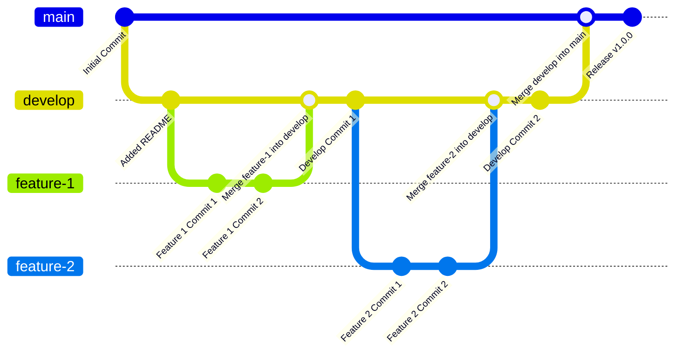

<div align="center">
  
</div>

# GIT and GitHub Documentation 📘

This documentation provides comprehensive guidelines for using GTI (Git Tool Interface) and GitHub, covering key functionalities, setup processes, and best practices.

## Introduction 🚀

Git is a version control system that allows you to track changes to your files and collaborate with others. It manages the history of your code and merges changes from different branches. In this tutorial, we'll cover essential Git and GitHub concepts and commands.

## What is Git? 🌟

Git is like the superhero of version control systems, created by Linus Torvalds in 2005 and now maintained by Junio Hamano. Git helps track code changes, identify contributors, and simplify coding collaboration.

### Git's Capabilities 🛠️

- Manages projects with repositories.
- Tracks changes with features like staging and committing.
- Supports branching and merging.
- Facilitates pulling and pushing updates.

#### Uses of Git 🎯

- Tracking code changes.
- Tracking who made changes.
- Coding collaboration.

## Working with Git 🛠️

1. **Initialize Git**: Transform a regular folder into a Git repository.
    ```cmd
    git init
    ```
2. **Track Changes**: Git tracks when files are changed, added, or deleted.
    ```cmd
    git status
    ```
3. **Stage and Commit**: Select changes to keep (stage) and create a permanent snapshot (commit).
    ```cmd
    git add <file>
    git commit -m "commit message"
    ```
4. **Time Travel**: Revert to any previous version of your project.

## Why Git? 🚀

- **Popularity**: Over 70% of developers use Git.
- **Global Collaboration**: Facilitates teamwork across distances.
- **Full Project History**: Tracks every change in your project.
- **Undo Button**: Allows rolling back to previous versions.

## GitHub Overview 🌐

GitHub, owned by Microsoft, complements Git by providing additional tools and features. It hosts millions of repositories and supports collaboration on a global scale.

## What is a Repository? 📁

A repository is a central location for storing and managing code. It tracks changes, manages versions, and facilitates collaboration among developers.

## Setting Up Git 🛠️

1. **Install Git**:
    - **Windows**: Download from [Git for Windows](https://www.git-scm.com/).
    - **Mac**: Use Homebrew with `brew install git` or download from [Git for Mac](https://git-scm.com/download/mac).
    - **Linux**: Install via package manager, e.g., `sudo apt-get install git` for Debian-based distributions.

2. **Verify Installation**:
    ```cmd
    git --version
    ```
3. **Configure Git**:
    ```cmd
    git config --global user.name "Your Name"
    git config --global user.email "your.email@example.com"
    git config --list
    ```

4. **Install Visual Studio Code**: Download from [Visual Studio Code](https://code.visualstudio.com/).

5. **Install Git Extension in VS Code**:
    - Open VS Code.
    - Go to the Extensions view and install "GitLens" for enhanced Git capabilities.

6. **Change Default Code Editor**:
    ```cmd
    git config --global core.editor "code --wait"
    ```

## Initialize Folder into Git Repository 📁

1. Create a folder and open it in VS Code.
2. Open the terminal in VS Code.
3. Initialize a new Git repository:
    ```cmd
    git init
    ```

## Commit Changes 🔨

1. **Write Code**: Make changes to your files.
2. **Add Files**:
    ```cmd
    git add <file>
    git add .
    ```
3. **Commit Changes**:
    ```cmd
    git commit -m "commit message"
    ```
4. **Check Status** (optional):
    ```cmd
    git status
    ```

## Git Log 📜

The `git log` command displays the commit history of your repository. Using the `--oneline` option condenses the output to show each commit in a single line.

```cmd
git log --oneline
```

## .gitignore 🔒

The `.gitignore` file specifies which files or directories to ignore, ensuring they are not committed to the repository.

### Example:
``` 
# Ignore node_modules directory
node_modules/

# Ignore all .log files
*.log

# Ignore specific file
secret.txt
```

## .gitkeep


The `.gitkeep` file is an empty file that ensures a directory is tracked by Git, even if it has no files inside it.

## GitHub 🌐

1. **Create Repository**: Start a new repository on GitHub.
2. **Push Changes**: Connect your local repository to GitHub.
    ```cmd
    git remote add origin <repository_URL>
    git branch -M main
    git push -u origin main
    ```
3. **Clone Repository**: Download a copy of a repository from GitHub to your local machine.
    ```cmd
    git clone <repository_URL>
    ```

## GitHub Flow 🌊

GitHub Flow is a lightweight, branch-based workflow that supports teams and projects where deployments are made regularly. It encourages continuous integration and collaboration.

### Key Steps:

1. **Create a Branch**: Start new work in a branch.
2. **Add Commits**: Make regular commits to track progress.
3. **Open a Pull Request**: Discuss changes with others before merging.
4. **Discuss and Review Code**: Collaborate on feedback and improvements.
5. **Merge Pull Request**: Incorporate changes into the main branch.
6. **Deploy**: Automate deployments after merging.


# Branches in git
Git branches are a core feature in version control, allowing developers to work on different parts of a project simultaneously without interfering with the main codebase.

#### What is a Git Branch?
A Git branch is a separate line of development. Think of it as a new copy of your project where you can make changes without affecting the main codebase.

#### Why Use Branches?
- **Parallel Development**v : Work on multiple features or bug fixes at the same time.
- **Isolation** : Keep changes separate until they’re ready to be merged.
- **Collaboration** : Multiple developers can work on different branches without conflicts.


####  **Creating a new branch**
To create a new branch, you can use the following command:


> `git branch` - This command lists all the branches in the current repository.

```cmd
  git branch
```

> `git branch BRANCH_NAME` - This command creates a new branch called `BRANCH_NAME`.

```cmd
  git branch BRANCH_NAME
```
> `git switch BRANCH_NAME` - This command switches to the `BRANCH_NAME` branch.

```cmd
  git switch BRANCH_NAME
```

> `git switch -c another_branch` - This command creates a new branch. the `-c` flag is used to create a new branch.

```cmd
  git switch -c another_branch
```

> `git checkout BRANCH_NAME` - This command switches to the `BRANCH_NAME` branch.

```cmd
  git checkout BRANCH_NAME
```

# Rename Branches in Git

Renaming branches in Git can be an essential part of maintaining a clean and organized repository. Here's a simple guide to help you through the process.

#### Why Rename Branches?
- Clarify branch purpose: A clearer name can better describe the branch's function or contents.
- Fix typos: Correct any mistakes made when the branch was first created.
- Follow naming conventions: Ensure consistency and adherence to project guidelines.

#### Steps to Rename a Local Branch
1. Rename the Current Branch
If you are on the branch you want to rename, follow these steps:
    1. Check the current branch:
  ```cmd
    git branch
  ```
  The current branch will have an asterisk (*) next to it.

  2. Rename the branch:
```cmd
  git branch -m new-branch-name
```
Replace `new-branch-name` with your desired branch name.

2. Rename a Different Local Branch
If you are not on the branch you want to rename:

    1. Rename the branch:
  ```cmd
  git branch -m old-branch-name new-branch-name
  ```
  Replace `old-branch-name` with the current name and `new-branch-name` with the desired name.

#### Delete a branch
You can delete a branch using the following command:

```cmd
git branch -d <branch-name>
```

Checkout a branch
You can checkout a branch using the following command:

```cmd
git checkout <branch-name>
```

Checkout a branch means that you are going to work on that branch. You can checkout any branch you want.

List all branches
You can list all branches using the following command:

```cmd
git branch
```
List all branches means that you are going to see all the branches in your repository.


# Merging Branches in Git


Merging branches in Git is a common task that helps integrate changes from different lines of development. However, it can sometimes lead to conflicts that need to be resolved. Here’s a simple guide to help you navigate through merging and handling conflicts effectively.

## What is Merging in Git?
Merging combines the changes from two branches into one. It’s essential for collaboration, ensuring that all contributions are integrated into the main codebase.


### Types of Merges
- **Fast-forward merge**: When the target branch has no new commits since the feature branch was created.
- **Three-way merge**: When both branches have unique commits.

## Steps to Merge Branches
1. **Checkout the target branch** (e.g., `main` or `master`):
   ```bash
   git checkout main
   ```
2. **Pull the latest changes** from the remote repository:
   ```bash
   git pull origin main
   ```
3. **Merge the feature branch** into the target branch:
   ```bash
   git merge feature-branch
   ```

# Handling Merge Conflicts
Conflicts occur when changes in different branches overlap. Here’s how to manage them:

1. **Identify the conflict**:
   - Git will mark conflicts in the files with special markers (e.g., `<<<<<<< HEAD`).

2. **Resolve the conflict**:
   - **Open the conflicting file** and edit the marked sections to choose or combine the changes.

3. **Mark the conflict as resolved**:
   ```bash
   git add resolved-file
   ```

4. **Commit the merge**:
   ```bash
   git commit -m "Resolved merge conflict"
   ```


## Interactive Rebase 🔄

Interactive rebase allows you to modify commit history by editing, combining, and deleting commits before pushing changes to the remote repository.

### Steps to Perform Interactive Rebase:

1. **Start Interactive Rebase**:
    ```cmd
    git rebase -i HEAD~n
    ```

2. **Edit Commits**:
    - Pick commits to edit, reorder, or squash.

3. **Complete Rebase**:
    - Save changes and exit.

### Interactive Rebase Commands:

- **pick**: Use commit as-is.
- **reword**: Use commit and edit commit message.
- **edit**: Use commit and stop for amending.
- **squash**: Combine with previous commit.
- **drop**: Remove commit.

## Cherry-Picking 🍒

Cherry-picking allows you to select specific commits from one branch and apply them to another branch.

### Steps to Cherry-Pick:

1. **Identify Commit**:
    - Find commit hash or reference.

2. **Apply Commit**:
    ```cmd
    git cherry-pick <commit_hash>
    ```

## Git Submodules 📦

Git submodules allow you to include and manage external repositories within your own repository. They are useful for modularizing code and dependencies.

### Adding Submodule:

```cmd
git submodule add <repository_URL> <path>
```

### Updating Submodule:

```cmd
git submodule update --remote
```

## GitHub Actions 🏃‍♂️

GitHub Actions automate workflows, enabling you to build, test, and deploy your projects on GitHub.

### Example Workflow:

```yaml
name: CI

on: [push]

jobs:
  build:
    runs-on: ubuntu-latest

    steps:
    - uses: actions/checkout@v2
    - name: Set up Node.js
      uses: actions/setup-node@v2
      with:
        node-version: '14'
    - name: Install dependencies
      run: npm install
    - name: Run tests
      run: npm test
```

---
## Interactive Rebase ✨
Interactive rebase is a powerful Git tool that allows you to rewrite commit history in a flexible and controlled way. You can reorder, edit, combine, or delete commits.

### Commands and Examples
- **Start an interactive rebase**:
  ```sh
  git rebase -i HEAD~3
  ```
  This command will open an editor for the last 3 commits.

- **Pick a commit**:
  ```sh
  pick abc1234 Commit message
  ```

- **Edit a commit**:
  ```sh
  edit abc1234 Commit message
  ```

- **Squash commits**:
  ```sh
  squash abc1234 Commit message
  ```

### Example Workflow
1. Start an interactive rebase for the last 3 commits.
2. Change the order of commits or mark commits to be edited or squashed.
3. Save and close the editor.
4. Make necessary changes and continue the rebase.

## Cherry-Picking 🍒

### What is Cherry-Picking?
Cherry-picking in Git allows you to apply the changes introduced by some existing commits to another branch.

### Commands and Examples
- **Cherry-pick a commit**:
  ```sh
  git cherry-pick abc1234
  ```

### Example Workflow
1. Identify the commit you want to cherry-pick.
2. Execute the cherry-pick command with the commit hash.
3. Resolve any conflicts and commit the changes.

## Submodules 📦

### What are Submodules?
Submodules allow you to include and manage a repository within another repository.

### Commands and Examples
- **Add a submodule**:
  ```sh
  git submodule add https://github.com/example/repo.git
  ```

- **Update submodules**:
  ```sh
  git submodule update --init --recursive
  ```

### Example Workflow
1. Add a submodule to your repository.
2. Commit the submodule addition.
3. Clone the repository with submodules.

## Visual Aids 🎨



### Diagrams and Flowcharts
- Include diagrams to illustrate Git workflows.
- Use flowcharts to show the rebase or cherry-picking process.

### Screenshots
- Provide screenshots of Git commands in action.
- Show examples of conflict resolution and submodule updates.


## Real-World Examples 🌐

### Case Studies

#### Interactive Rebase Cleanup
Imagine a development team working on a complex software project preparing for a major release. They used interactive rebase extensively to clean up their commit history. This process allowed them to:

- **Squash Commits**: Combine related changes into cohesive commits.
- **Reorder Commits**: Arrange commits logically for better readability.
- **Edit Commit Messages**: Ensure clear and informative commit messages.

By using interactive rebase, the team streamlined their commit history, making it easier to review and understand the changes made over the development cycle.

#### Cherry-Picking Hotfixes
In another scenario, a critical bug was discovered in a production environment requiring immediate attention. The team needed to apply the fix to multiple branches, including both the current release and a previous stable version. Cherry-picking enabled them to:

- **Select Specific Commits**: Identify and apply the exact fix without including unrelated changes.
- **Maintain Branch Isolation**: Ensure the fix was applied cleanly to each targeted branch.

This approach allowed the team to deploy the hotfix swiftly across different environments while maintaining code stability.

### Common Workflows

#### Feature Branch Workflow with Rebase
The feature branch workflow with rebase is a common practice in agile development. Here’s how it works:

1. **Create a Feature Branch**: Start new development on a dedicated branch.
   ```cmd
   git checkout -b feature/my-feature
   ```

2. **Commit Changes**: Make iterative commits on the feature branch.
   ```cmd
   git add .
   git commit -m "Implement feature XYZ"
   ```

3. **Rebase with Main Branch**: Keep the feature branch up to date with the main branch.
   ```cmd
   git fetch origin
   git rebase origin/main
   ```

4. **Resolve Conflicts**: Address any conflicts that arise during the rebase process.

5. **Merge into Main Branch**: Once development is complete and reviewed, merge the feature branch into the main branch.
   ```cmd
   git checkout main
   git merge --no-ff feature/my-feature
   ```

#### Using Submodules for Project Dependencies
Submodules are invaluable for managing project dependencies, especially when integrating external libraries or repositories. Here’s how you can use submodules effectively:

1. **Add Submodule**: Integrate an external repository into your project.
   ```cmd
   git submodule add <repository_URL> <path>
   ```

2. **Update Submodule**: Keep submodule content up to date.
   ```cmd
   git submodule update --remote
   ```

3. **Clone with Submodules**: Clone a repository and initialize submodules.
   ```cmd
   git clone --recurse-submodules <repository_URL>
   ```

4. **Collaborate with Submodules**: Collaborate seamlessly with teams using submodules, ensuring consistent versions and dependencies across environments.

These workflows and examples illustrate practical applications of Git features in real-world scenarios, enhancing collaboration and code management in software development projects.
```

This section adds detailed case studies and workflows with emojis and symbols to enhance readability and engagement in your README.

## Troubleshooting 🛠️

### Common Errors
- **Merge conflicts during rebase**:
  ```sh
  git rebase --abort
  git rebase --continue
  ```
- **Submodule cloning issues**:
  ```sh
  git submodule update --init --recursive
  ```

### FAQs
- **How to resolve rebase conflicts?**
  Resolve conflicts in the files and use `git rebase --continue`.

- **How to remove a submodule?**
  Remove the relevant section from the `.gitmodules` file and delete the submodule directory.

## Security 🔐

### Best Practices for Repository Security
- **Use SSH keys** for authentication.
- **Enable two-factor authentication** (2FA) on your Git service.
- **Review and limit repository access**.
- **Regularly update dependencies** to patch vulnerabilities.
- **Sign commits** with GPG to verify authorship:
  ```sh
  git commit -S -m "Signed commit"
  ```

---

## Conclusion
Understanding advanced Git topics like interactive rebase, cherry-picking, and submodules can greatly enhance your version control workflows. Remember to use visual aids, refer to real-world examples, troubleshoot common issues, and follow best security practices to ensure a smooth and secure Git experience.
